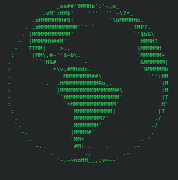

#Планета крутится, планета вертится<br>
###Планета крутится в терминале, используя 13 заранее подготовленных картинок.

Запуск скрипта:
1. Открыть терминал
2. Перейти в директорию со скриптом
3. Ввести в командную строку код
```python
python planet.py
```


